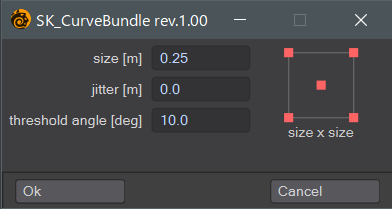

# SK_CurveBundle

カーブの束を作成するLightwave Modeler用スクリプトです。

4点ポリゴンで構成されたモデルを解析し、カーブの束を生成します。

https://user-images.githubusercontent.com/2740841/224530467-33dae7ba-5e3f-4a7c-b4e7-2ff232bc618d.mp4

ポリゴンの並びは、1行n列である必要があります。

また、4点ポリゴン以外が含まれていた場合は、正常に動作しません。

## Insallation

## Usage

カーブの開始位置となるポリゴンを1つ以上選択して、プラグインを実行します。

ダイアログで必要な値を設定してOKボタンを押します。

### size (m)

生成するカーブの密度(本数)に関連する値です。

実行時にポリゴンのサイズに合わせて微調整されるので、おおよその値と考えてください。

### jitter (m)

カーブのコントロールポイントをランダムに移動します。

カーブにランダム性が必要な場合は0より大きい数値を設定してください。

### threshold angle (deg)

ポリゴンの解析に影響する値です。

隣接しているポリゴンを探す際にノーマルベクトルの差を利用しています。

この角度以上の面のみが検索の対象となります。

ポリゴンの解析に失敗した場合は、エラーが表示され動作が停止します。

## Changelog

- rev.1.00 - 13 Mar 2023
    - Release of version 1.00, first public release.
